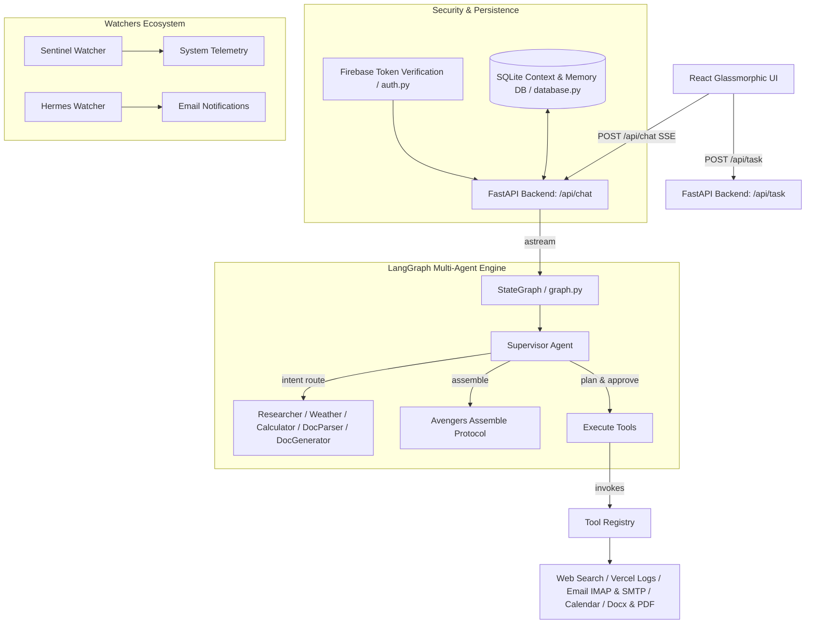

# 🤖 Autonomous Multi-Step AI Agent

An advanced, full-stack enterprise autonomous agent platform designed to execute complex multi-step business workflows, perform real-time web research, monitor live Vercel deployments, process documents, maintain persistent long-term memory, and enforce Google Firebase authentication.

The system converts high-level natural language instructions into structured execution plans, executes them using a modular suite of tools, streams real-time status updates via Server-Sent Events (SSE), and guarantees resilience through a robust validation and retry architecture.

---

## 🎯 Project Overview & Key Architecture Highlights

Built to deliver high-reliability multi-agent reasoning, task decomposition, and tool orchestration, the system features:

1. **Dual LLM Engine**: Primary ultra-fast inference powered by **Groq** (`openai/gpt-oss-120b`, `qwen/qwen3.6-27b`) with robust fallback to **Krutrim Cloud API**.
2. **LangGraph Multi-Agent State Machine**: Asynchronous state machine (`core/graph.py`) with intent-based routing to specialized agents (Researcher, Doc Generator, Doc Parser, Calculator, Weather, Planner, Executor).
3. **Sequential Orchestrator Engine**: Lifecycle pipeline (`core/orchestrator.py`) supporting structured step decomposition, tool selection, validation, and retry with exponential backoff.
4. **System Watchers & Avengers Assemble Protocol**: Automated background telemetry (`core/watchers/`) including `sentinel_watcher`, `hermes_watcher`, and an interactive `/api/assemble` briefing sequence.
5. **Persistent Context & Long-Term Memory**: SQLite-backed database (`core/database.py` -> `data/context_memory.db`) storing full chat context, long-term user facts, and execution traces.
6. **Enterprise Security & Auth**: Google Firebase ID token cryptographic validation (`core/auth.py`) with local Google X.509 public RSA certificate caching and local guest token support.
7. **Vercel Telemetry Integration**: Live inspection of project deployments, build logs, and serverless runtime logs via Vercel REST API.

---

## 🏗 System Architecture



### Core Execution Frameworks

* **LangGraph Engine ([core/graph.py](file:///d:/Autonomous-Multi-Step-AI-Agent/core/graph.py))**: Asynchronous, streamable state machine that dynamically routes user intents to specialized agent nodes and streams real-time updates via Server-Sent Events (SSE).
* **Sequential Orchestrator ([core/orchestrator.py](file:///d:/Autonomous-Multi-Step-AI-Agent/core/orchestrator.py))**: Synchronous pipeline coordinating `PlannerAgent`, `ToolSelectorAgent`, `ExecutorAgent`, `ValidatorAgent`, and `RetryManager`.
* **Database & Memory ([core/database.py](file:///d:/Autonomous-Multi-Step-AI-Agent/core/database.py))**: Manages SQLite storage for chat history (`messages`), session records (`conversations`), long-term facts (`user_memory`), and multi-step execution logs (`execution_traces`).
* **Authentication Engine ([core/auth.py](file:///d:/Autonomous-Multi-Step-AI-Agent/core/auth.py))**: Verifies Firebase Google Bearer tokens by caching Google's public X.509 RSA certificates locally and validating token signature, expiration, issuer, and audience.

---

## 🛠️ Tool Suite

| Tool | Capability | Source / Provider |
| :--- | :--- | :--- |
| **Web Search** | Live web research, news & instant answers | SerpApi (Google Search) |
| **Vercel Manager** | Deployment status, build output & runtime logs | Vercel REST API (v6/v2) |
| **Email & Inbox** | Send HTML emails & read/search IMAP inbox | Gmail SMTP & IMAP |
| **Calendar Manager**| Meeting scheduling, availability & iCal parsing | Custom Calendar & `icalendar` |
| **Doc Parser** | Extract text & structure from PDF, Docx, TXT | PyPDF2, python-docx |
| **Doc Generator** | Generate formatted `.docx` reports | python-docx |
| **System Info** | OS telemetry, memory, Python environment | System Tools |
| **Calculator** | Scientific mathematical computations | Safe AST-evaluated Math Engine |
| **Weather** | Real-time global weather data | wttr.in |

---

## 🔌 API Endpoints Reference

| Endpoint | Method | Auth | Description |
| :--- | :--- | :--- | :--- |
| `/api/chat` | `POST` | Bearer Token | Main conversational agent endpoint. Returns SSE stream of node updates. |
| `/api/task` | `POST` | Bearer Token | Executes structured multi-step tasks synchronously via the Orchestrator. |
| `/api/context/{conv_id}` | `GET` | Bearer Token | Retrieves saved conversation history from the SQLite database. |
| `/api/memories/{user_id}` | `GET` | Bearer Token | Fetches long-term facts and memories stored for the authenticated user. |
| `/api/vercel/deployments` | `GET` | Bearer Token | Returns live Vercel deployments for the configured project. |
| `/api/vercel/logs` | `GET` | Bearer Token | Retrieves build and runtime logs for a specific Vercel deployment. |
| `/api/download/{filename}`| `GET` | Public | Securely downloads generated `.docx` document reports. |
| `/api/assemble` | `GET/POST`| Bearer Token | Triggers the system-wide "Avengers Assemble" agent briefing sequence. |
| `/health` | `GET` | Public | Service health check. |

---

## 📁 Repository Structure

```text
Autonomous-Multi-Step-AI-Agent/
├── agents/                  # Specialized agent modules (planner, executor, doc_generator, etc.)
├── api/                     # Serverless API entrypoint (Vercel deployment)
│   └── index.py
├── api.py                   # Main FastAPI application server & REST/SSE endpoints
├── core/                    # Core architecture components
│   ├── auth.py              # Firebase JWT authentication & certificate validation
│   ├── database.py          # SQLite context memory, user memory & trace logging
│   ├── graph.py             # LangGraph multi-agent state machine & supervisor
│   ├── memory.py            # Long-term memory manager
│   ├── orchestrator.py      # Sequential multi-step execution pipeline
│   ├── utils.py             # LLM client wrappers (Groq & Krutrim Cloud)
│   └── watchers/            # System telemetry & notification watchers
│       ├── assemble_diagnostics.py
│       ├── hermes_watcher.py
│       └── sentinel_watcher.py
├── data/                    # SQLite database storage directory
├── docs/                    # Architecture documentation & design guides
│   └── architecture.md
├── frontend/                # React / Vite glassmorphic frontend UI
│   ├── src/
│   │   ├── components/      # UI components (AgentAssembleBar, DeploymentPanel, etc.)
│   │   ├── AuthContext.jsx  # Firebase Google Auth context
│   │   └── App.jsx          # Main chat & task execution interface
│   ├── package.json
│   └── vite.config.js
├── models.py                # Pydantic data models (Task, Step, ExecutionResult)
├── requirements.txt         # Backend Python dependencies
├── requirements-vercel.txt  # Serverless deployment dependencies
├── railway.json             # Railway deployment configuration
├── vercel.json              # Vercel deployment configuration
├── LOCAL_SETUP_AND_TESTING.md # Guide for local setup, running servers, & unit testing
├── main.py                  # CLI task execution entrypoint
└── tests/                   # Comprehensive Python unittest suite
```

---

## 🧑‍💻 Technical Demonstration Prompts

Try these prompts in the chat interface:
- **Web Research & Report**: *"Research the latest breakthroughs in fusion energy and generate a structured document report."*
- **Vercel Telemetry**: *"Fetch our active Vercel deployments and check the runtime logs."*
- **Email & Calendar**: *"Schedule a sync meeting with the team for tomorrow at 10 AM and send a confirmation email."*
- **Avengers Assemble**: *"Trigger the Avengers Assemble briefing protocol across all specialized agents."*
- **Document Analysis**: *"Analyze the document at path/to/report.pdf and summarize its key findings."*

---

## 📖 Local Setup, Execution & Testing Guide

For detailed instructions on setting up environment variables, running the backend FastAPI server and React frontend locally, and executing the unittest test suite, please refer to the dedicated setup guide:

👉 **[LOCAL_SETUP_AND_TESTING.md](file:///d:/Autonomous-Multi-Step-AI-Agent/LOCAL_SETUP_AND_TESTING.md)**

---

## 🚢 Deployment Options

* **Vercel**: Configured via `vercel.json` and `api/index.py` for serverless backend execution.
* **Railway**: Production deployment manifest included in `railway.json`.
