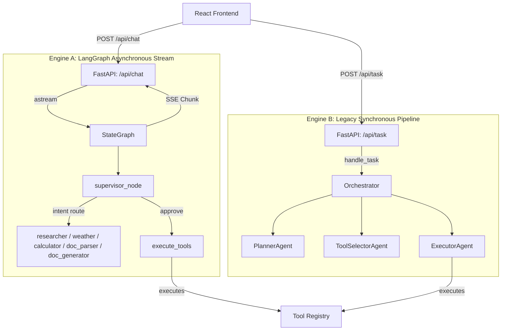

# Code Architecture & Quality Review
## Autonomous Multi-Step AI Agent (MVP)

This document provides a professional, deep-dive architectural and quality review of the Autonomous Multi-Step AI Agent codebase. It evaluates the project's layout, design choices, data flow, concurrency patterns, security boundaries, and highlights specific bugs and technical debt, along with structured recommendations for production readiness.

---

## 1. Executive Summary

The codebase implements a multi-agent orchestration framework utilizing **FastAPI**, **LangGraph** (for graph-based state transitions), and a **React/Vite** frontend using **Firebase/Firestore** for persistence. 

### Key Strengths:
* **Hybrid Execution Paradigm**: The combination of intent-based routing (classifier to specialized agent nodes) and dynamic sequencing (planner generating multi-step JSON tool pipelines) is highly flexible.
* **Resilient Parsing**: Heavy heuristic fallbacks in `planner_node` ([core/graph.py](file:///D:/Autonomous-Multi-Step-AI-Agent/core/graph.py#L357-L445)) gracefully recover when models fail to emit clean JSON.
* **Observability & UX**: Server-Sent Events (SSE) streaming maps LangGraph updates directly to a node-by-node thinking state animation on the UI.

### Critical Weaknesses:
* **Duplicate Execution Pathways**: Synchronous orchestration in `core/orchestrator.py` vs. asynchronous LangGraph execution in `core/graph.py` splits the core logic into two distinct, diverging maintainability tracks.
* **Stateful Module-Level Variables**: The reliance on `_pending_plans = {}` inside `core/graph.py` is a blocking issue for concurrent sessions and horizontal scaling.
* **In-Process Concurrency & I/O Vulnerabilities**: Storing JSON files on disk (`memory.json` in [core/memory.py](file:///D:/Autonomous-Multi-Step-AI-Agent/core/memory.py)) will lead to corrupt state under parallel workloads.
* **Duplicate Graph Nodes & Tool Definitions**: The parser/generator tools are implemented twice (once under `agents/` and once under `tools/`), leading to copy-paste bugs.

---

## 2. Architectural Deep-Dive & Data Flow



### The Split-Brain Orchestration Problem
The codebase is currently split into two execution engines:
1. **The Modern Graph Engine** ([core/graph.py](file:///D:/Autonomous-Multi-Step-AI-Agent/core/graph.py)): A state machine running on LangGraph that manages a feedback loop (Supervisor -> Planner -> User Approval -> Executor -> Supervisor).
2. **The Legacy Sync Engine** ([core/orchestrator.py](file:///D:/Autonomous-Multi-Step-AI-Agent/core/orchestrator.py)): A synchronous `for step in task.steps:` loop using older agents (`agents/planner.py`, `agents/executor.py`, etc.).

*Architectural Recommendation*: The synchronous `api.py` endpoint `/api/task` and the `main.py` CLI should be refactored to run the `agent_graph` synchronously (using `agent_graph.invoke()`) instead of maintaining an independent agent pipeline in `core/orchestrator.py`.

---

## 3. Detailed Code Analysis & Critical Bugs

### Bug 1: Dead Code & Incorrect Headings in `doc_generator`
* **File Location**: [`agents/doc_generator.py`](file:///D:/Autonomous-Multi-Step-AI-Agent/agents/doc_generator.py#L33-L40)
* **Code Snippet**:
  ```python
  if line.startswith('#'):
      heading_text = line.lstrip('#').strip()
      doc.add_heading(heading_text, level=1)
  elif line.startswith('##'):
      heading_text = line.lstrip('#').strip()
      doc.add_heading(heading_text, level=2)
  ```
* **Impact**: Because any line starting with `##` also starts with `#`, the first `if` condition evaluates to `True`. The `elif` block is **dead code** and will never execute. All headings generated by this node are hardcoded to Level 1.
* **Contrast**: In [`tools/agent_tools.py`](file:///D:/Autonomous-Multi-Step-AI-Agent/tools/agent_tools.py#L58-L61), this logic is handled correctly:
  ```python
  if line.startswith('#'):
      heading_text = line.lstrip('#').strip()
      level = 1 if not line.startswith('##') else 2
      doc.add_heading(heading_text, level=level)
  ```

### Bug 2: Concurrency & State Leak in `_pending_plans`
* **File Location**: [`core/graph.py`](file:///D:/Autonomous-Multi-Step-AI-Agent/core/graph.py#L48)
* **Code Snippet**:
  ```python
  _pending_plans = {}
  ...
  _pending_plans["latest"] = plan
  ...
  plan_data = _pending_plans.pop("latest", None)
  ```
* **Impact**: `_pending_plans` is a module-level global dictionary. If two users submit concurrent requests to `/api/chat`, User B's plan will overwrite `_pending_plans["latest"]`. When User A replies "Approve", the executor will run User B's plan in User A's context, leading to a critical **data-leak and session corruption**.
* **Architectural Fix**: Store the pending plan inside the LangGraph `AgentState` under the `metadata` dictionary or `state` variables, persisting it securely in the graph state rather than a global Python dictionary.

### Bug 3: File System Concurrency and Overwrite Risks
* **File Location**: [`core/memory.py`](file:///D:/Autonomous-Multi-Step-AI-Agent/core/memory.py#L19-L22)
* **Code Snippet**:
  ```python
  def _save_to_disk(self):
      with open(self.filename, 'w', encoding='utf-8') as f:
          json.dump(self._store, f, indent=2)
  ```
* **Impact**: Under concurrent load, multiple threads will attempt to write to `memory.json` simultaneously. This will cause file write locks, partial/corrupted writes, and data loss.
* **Architectural Fix**: Replace the file-based `MemoryManager` with a Redis instance or a Postgres schema.

### Security Concern: AST Node Validation in Calculator
* **File Location**: [`core/graph.py`](file:///D:/Autonomous-Multi-Step-AI-Agent/core/graph.py#L612-L628)
* **Design Decision**: The calculator parses the mathematical expression using Python's `ast` module and inspects safe node types before executing `eval()`.
* **Security Evaluation**: While checking node types is safer than raw `eval()`, using `eval` on user inputs is a high-risk practice. 
* **Fix**: Use a dedicated safe mathematical parser library such as `simpleeval` or write a minimal recursive-descent parsing function to isolate calculation steps completely.

---

## 4. Frontend State Sync Anomalies

### Race Conditions in Firestore Logging
* **File Location**: [`frontend/src/App.jsx`](file:///D:/Autonomous-Multi-Step-AI-Agent/frontend/src/App.jsx#L88-L156)
* **Observation**: 
  When a user sends a message:
  1. The message is pushed to Firestore asynchronously (`addDoc`).
  2. The message is optimistically appended to local state (`setMessages`).
  3. A POST request is made to `/api/chat`, returning an SSE stream.
  4. Each chunk received in the SSE stream is *also* written to Firestore (`addDoc`) and appended locally.
  5. Concurrently, a Firestore `onSnapshot` listener is listening to changes and updating the `messages` array.
* **Impact**: The UI suffers from severe state-flickering, duplicate messages, and ordering bugs. Fast users can trigger concurrent writes that cross-talk or get out of chronological order due to server latency differentials.
* **Recommendation**: Standardize the stream data flow. Do not use Firestore `onSnapshot` to update the active chat window in real-time. Instead, use Firestore purely as an archival database for loading conversation history on mount, and manage the active session history entirely within React state.

---

## 5. Architectural Improvements Roadmap

| Area | Current Implementation | Principal/Senior Architecture Pattern | Priority |
| :--- | :--- | :--- | :--- |
| **Engine Consolidation** | Separate sync (`core/orchestrator.py`) and async (`core/graph.py`) execution frameworks. | Consolidate onto LangGraph. Invoke the graph synchronously for `/api/task` and asynchronously for `/api/chat`. | **High** |
| **State Isolation** | Global `_pending_plans` dict inside graph module. | Store pending execution plans directly in the LangGraph `AgentState` variables. | **High** |
| **Duplicate Code** | Copy-pasted parse/generate logic under `agents/` nodes and `tools/` functions. | Remove individual node definitions in `agents/doc_generator.py` and `agents/doc_parser.py`. Standardize on executing tools via the `ToolRegistry` dynamically. | **Medium** |
| **State Persistence** | Disk-based `memory.json`. | Transition to PostgreSQL or Redis with partition keys based on `user_id` and `conversation_id`. | **Medium** |
| **Frontend Sync** | Bi-directional overlapping updates (optimistic UI state + Firestore SSE writes + `onSnapshot` loop). | Use React state for active conversation history; update Firestore in background; query Firestore *only* on load. | **Medium** |
| **Calculator Security** | AST filtered `eval()`. | Replace `eval` execution with `simpleeval` or a custom parser. | **Low** |
