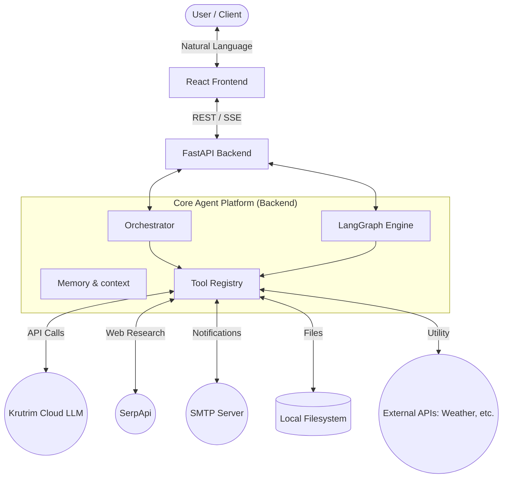
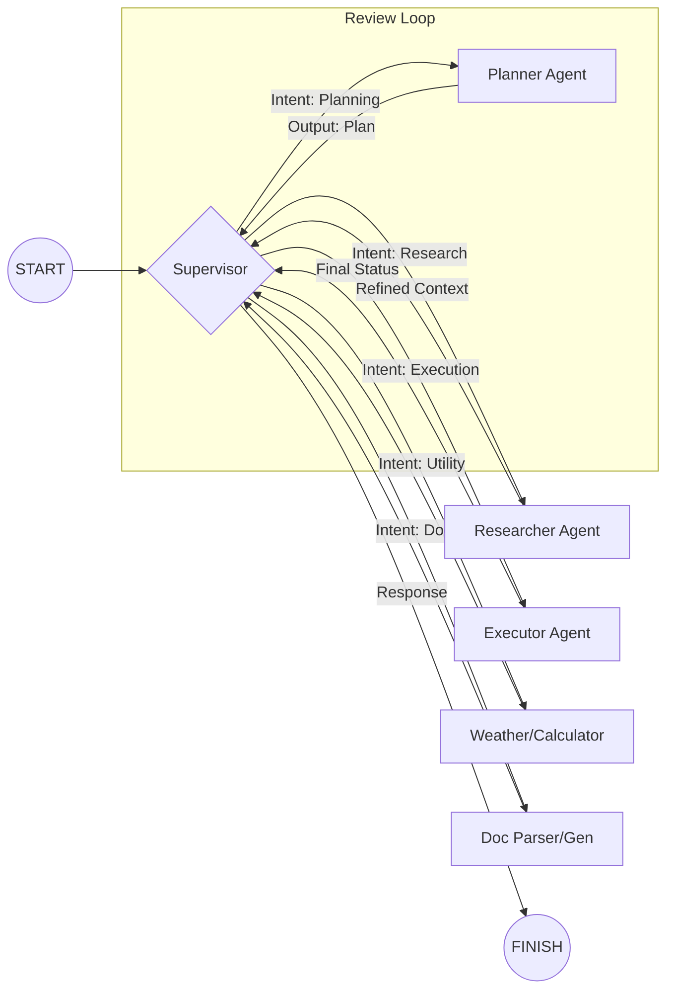
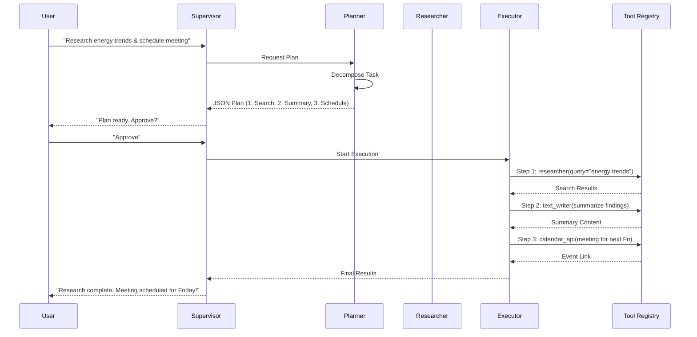

# 🏗️ Autonomous Multi-Step AI Agent: System Design & Architecture

This document provides a comprehensive technical overview of the **Autonomous Multi-Step AI Agent** platform. It is designed to help viewers understand the system's reasoning, orchestration, and execution capabilities without interacting with the application.

---

## 1. Executive Summary
The platform is a full-stack autonomous agent system that transforms high-level natural language instructions into actionable, multi-step plans. It leverages a dual-orchestration strategy:
1.  **Sequential Pipeline**: A reliable, linear execution model for structured workflows.
2.  **LangGraph Multi-Agent System**: A state-of-the-art graph-based orchestration for dynamic, conversational, and complex task decomposition.

---

## 2. High-Level Architecture

### System Context
The following diagram illustrates the interaction between the user, the core platform, and the external ecosystem of LLMs and APIs.



### Technology Stack
- **Frontend**: React (Vite), Tailwind CSS, Framer Motion (for animations).
- **Backend**: Python 3.10+, FastAPI, LangGraph.
- **AI/LLM**: Krutrim Cloud (Llama-3-8B-Instruct & Spectre-v2).
- **Persistence**: Local State (MVP) / Memory Store.

---

## 3. Core Components

### 3.1 Orchestration Models
The system supports two distinct ways of handling tasks:

| Component | Responsibility | Pattern |
| :--- | :--- | :--- |
| **Sequential Orchestrator** | Linear: Plan → Select → Execute → Validate | Pipeline |
| **LangGraph Supervisor** | Dynamic: Route → Act → Review → Loop | Multi-Agent Graph |

### 3.2 specialized Agents
The LangGraph implementation features specialized nodes:
- **Supervisor**: The central router that classifies intent and delegates tasks.
- **Planner**: Decomposes goals into a structured "Execution Plan" (JSON).
- **Executor**: Iteratively triggers tools based on the plan.
- **Researcher**: Performs live web searches and synthesizes findings.
- **DocGenerator/Parser**: Handles complex document I/O.

### 3.3 Tool Registry
A unified interface for all external capabilities. Each tool is registered with its metadata and implementation.

---

## 4. Multi-Agent Workflow (LangGraph)
The heart of the system is the **StateGraph**, where agents collaborate to fulfill requests.



---

## 5. Execution Sequence: A Real-World Example
**Task**: *"Research renewable energy trends, write a summary, and schedule a review meeting with team@example.com."*



---

## 6. Resilience & Intelligence
- **Heuristic Fallback**: If the LLM fails to produce valid JSON, the system uses regex and keyword heuristics to synthesize an execution plan.
- **Output Framing**: Raw API data (e.g., search results) is fed back into the LLM to provide a conversational, human-friendly summary.
- **Step Hydration**: Results from Step N are automatically injected into Step N+1 using placeholder logic like `{{STEP_1_OUTPUT}}`.

---

## 7. Data Structure: The "Execution Plan"
The Planner outputs a structured JSON object that the Executor understands:

```json
{
  "steps": [
    {
      "tool": "researcher",
      "args": { "query": "latest renewable energy trends 2024" }
    },
    {
      "tool": "text_writer",
      "args": { "prompt": "Based on {{STEP_1_OUTPUT}}, write a 200-word summary." }
    },
    {
      "tool": "calendar_api.create_event",
      "args": {
        "title": "Energy Trends Review",
        "attendees": ["team@example.com"],
        "time_slot": "Next Friday"
      }
    }
  ]
}
```

---

## 8. Summary
This architecture ensures that the **Autonomous Multi-Step AI Agent** is more than just a wrapper; it is a reasoning engine capable of complex, multi-modal task execution with built-in safety (Human-in-the-loop) and reliability (Heuristics & Validation).
